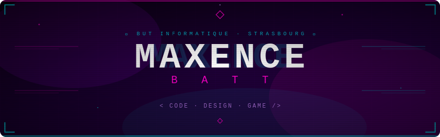

### `> BATT Maxence _ IUT Informatique Strasbourg`

*"Si ça ne vaut pas le coup d'être fait à fond, ça ne vaut pas le coup d'être fait tout court."*

---

## ⚡ `whoami`

Étudiant en **BUT Informatique** à l'IUT Robert Schuman (Université de Strasbourg), je code avec autant de passion que je joue.
Mon moteur : allier **logique pure du code** et **sensibilité du design** pour créer des expériences qui marquent.

- 🎮 **Mindset :** Compétiteur dans l'âme — optimiser un algo ou clutch un 1v5, c'est le même feeling
- 🎨 **Focus :** Applications fluides, interactives et visuellement marquantes
- 🕹️ **Objectif :** Développer mon propre jeu Unity de A à Z
- 💼 **Dispo :** Stage fin de 2e année — double compétence **Code & UX/UI**

---

## 🚀 Projet phare — *Stargate*

> Application **WinForms C#** connectée à une base de données, avec une attention particulière portée sur l'UX/UI.

| Feature | Détail |
|---|---|
| 🌌 Animations | Mouvements fluides de planètes intégrés directement dans l'interface |
| 👁️ Hover intelligent | Textes descriptifs contextuels au survol de la souris |
| 💾 Back-end SQL | Gestion complète des données et requêtes en arrière-plan |

🔗 [Voir le repo →](https://github.com/MaxenceBatt/Stargate-projet-IUT)

---

## 🧰 Stack techno

### Langages

### Outils & Environnements

### En cours d'apprentissage

---

## 📊 Stats GitHub

---

## 👾 Me retrouver

---

*`> Connexion établie. Bienvenue dans mon terminal. _`*

